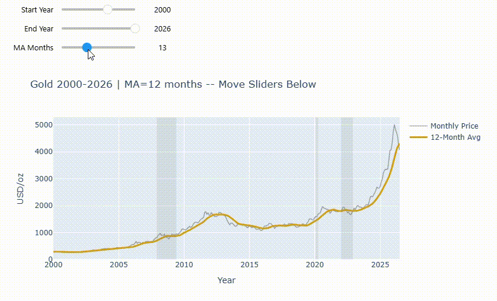
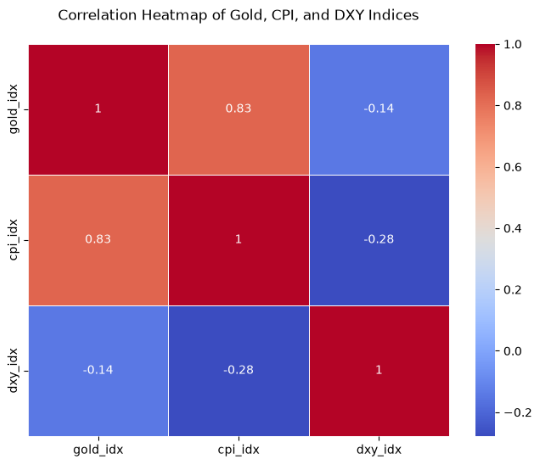

# Visual Gold Explorer: Why Gold Moves in Crisis (with Honest Baseline)

Gold spikes in crises — but can anyone actually predict it? This project visualizes 66 years of gold against inflation (CPI) and the dollar (DXY), then proves with a baseline that simple guesses still beat fancy ones.

**60-second review:** open one HTML file (no Jupyter needed) → drag charts → read 3 takeaways below.

## Open the interactive charts

- **Path A (gold only, 1960–2026):** `Visual-Gold-Explorer-PathA-interactive.html`
- **Path B (gold + CPI + DXY, 1979–2026):** `Visual-Gold-Explorer-PathB-interactive.html`

Sliders work only inside Jupyter (`Visual-Gold-Explorer-PathA.ipynb` / `Visual-Gold-Explorer-PathB.ipynb`). The HTML files are snapshots at defaults — fully zoomable.



## 3 takeaways

1. **Gold outran everything since 1979** (Index 100 = Dec 1979 → gold ~900, CPI ~430, DXY ~115). Static correlation: Gold-CPI 0.83 (together), Gold-DXY −0.14 (weakly opposite).
2. **In crises they decouple.** 2008: dollar spikes while gold dips first during August - October 2008. 2022: inflation surges yet gold goes flat (real rates bite). 2020: dip then rally.
3. **Honest baseline: naive wins.** Last 24 months MAE — Naive (next = last month) ~$153, MA3 ~$268, MA12 ~$622, Macro linear (CPI+DXY) ~$1700. Even *with* inflation + dollar, simple still wins — so design for resilience, not prediction.



## Limit (read this before citing)

- Monthly averages, not trading signals. CPI is revised and lagged; DXY resampled to month-start.
- Static correlation is inflated because gold and CPI both trend up — co-movement, not proof that inflation causes gold.
- Baseline tests the last 24 months including the 2024–2026 surge; errors are regime-dependent.

## Structure

```
Dataset/
  gold-price.csv                        monthly gold, 1960-01 → 2026-07 (hero)
  CPIAUCSL.csv                          monthly CPI, 1947-01 → 2026-07 (1 gap interpolated)
  US Dollar Index Historical Data.csv   daily DXY → resampled monthly, 1979-12 → 2026-09
Visual-Gold-Explorer-PathA.ipynb        gold only + sliders + baseline
Visual-Gold-Explorer-PathA-interactive  PathA charts exported here
Visual-Gold-Explorer-PathB.ipynb        + CPI/DXY merge, Index-100 view, Nixon 1960-79, heatmap, macro challenger
Visual-Gold-Explorer-PathB-interactive  PathB charts and correlation matrix screenshot exported here
assets/
  slider-drag.gif
  correlation-heatmap.png
```

## Reproduce

```bash
pip install pandas plotly ipywidgets openpyxl scikit-learn seaborn matplotlib
```

Open either notebook → `Kernel → Restart & Run All` → run the export cell to regenerate the HTML.
